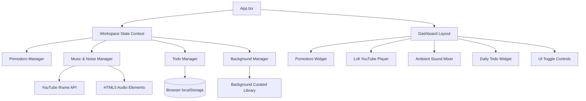

# Kiến trúc Kỹ thuật (Technical Architecture): VibeSpace

## 1. System Design Overview (Tổng quan thiết kế hệ thống)
VibeSpace là một ứng dụng Single Page Application (SPA) chỉ chạy hoàn toàn ở phía client-side. Vì ứng dụng không yêu cầu backend hay cơ sở dữ liệu người dùng (user database), tất cả tính năng đều được triển khai ở frontend. Trọng tâm kiến trúc đặt vào việc tối ưu hiệu năng cao (high performance), các hiệu ứng chuyển động mượt mà (smooth animations) và mã nguồn React dạng module hóa sạch sẽ (clean modular code).



---

## 2. Tech Stack (Công nghệ sử dụng)
- **Framework:** React 18+ kết hợp TypeScript (scaffold bằng Vite).
- **Styling (Định dạng giao diện):** Vanilla CSS (sử dụng CSS Modules hoặc CSS Variables tùy chỉnh) kết hợp với CSS Variables để kiểm soát màu sắc động và theme hệ thống. Phong cách Glassmorphism (`backdrop-filter`) được ứng dụng mạnh mẽ nhằm đem lại thiết kế UI hiện đại, cao cấp.
- **Audio Engines (Công cụ xử lý âm thanh):**
  - **YouTube Lofi:** Gọi trực tiếp YouTube Iframe Player API được tải một cách bất đồng bộ (dynamically loaded).
  - **Ambient Noise:** Sử dụng thẻ `<audio>` mặc định của HTML5, điều khiển thông qua các React refs.
- **Iconography (Hệ thống icon):** Lucide React (bộ icon gọn nhẹ, hiện đại và đồng bộ).
- **Storage (Lưu trữ cục bộ):** HTML5 `localStorage` để lưu trữ dữ liệu offline ổn định.

---

## 3. Directory Structure (Cấu trúc thư mục)
```text
vibe-space/
├── public/
│   ├── audio/              # Các vòng lặp âm thanh ambient được tối ưu hóa (.mp3/.ogg)
│   └── backgrounds/        # Các ảnh nền dự phòng cục bộ / tài nguyên tối ưu
├── src/
│   ├── assets/             # SVGs, icons, static assets của ứng dụng
│   ├── components/         # Các UI widgets có khả năng tái sử dụng
│   │   ├── Pomodoro/       # Component Pomodoro Timer và panel cài đặt
│   │   ├── MusicPlayer/    # Giao diện trình phát nhạc YouTube Lofi
│   │   ├── SoundMixer/     # Thanh trượt âm lượng và nút bật tắt white noise
│   │   ├── TodoList/       # Widget danh sách công việc hàng ngày và thanh progress
│   │   └── Background/     # Bộ chuyển đổi ảnh nền (background switcher)
│   ├── hooks/              # Các Custom React hooks tùy chỉnh
│   │   ├── useLocalStorage.ts
│   │   ├── useAudioMixer.ts
│   │   └── usePrecisionTimer.ts
│   ├── context/            # Global Workspace Context (quản lý settings, theme toàn cục)
│   ├── utils/              # Các helper functions (kiểm tra ngày tháng, format thời gian)
│   ├── index.css           # CSS lõi, định nghĩa variables và phong cách glassmorphism
│   ├── App.tsx             # Component chính lắp ráp toàn bộ dashboard
│   └── main.tsx            # Entry point (điểm đầu vào) của ứng dụng
├── package.json
└── tsconfig.json
```

---

## 4. Key Architectural Patterns (Mẫu kiến trúc cốt lõi)

### 4.1. Precise Timer Mechanism (Cơ chế đếm giờ chính xác - Kháng chế Browser Background Throttling)
Các hàm `setInterval` tiêu chuẩn của trình duyệt thường bị giảm tần suất chạy (throttled) khi tab chuyển sang chạy ngầm (background). Để giữ cho Pomodoro timer luôn chính xác:
- Timer sẽ tính toán thời gian còn lại (remaining time) dựa trên mốc thời gian thực (`Date.now()`) so sánh với thời điểm kết thúc mục tiêu (target end time) thay vì chỉ giảm bộ đếm đơn giản sau mỗi giây.
- Chúng ta có thể cấu hình tùy chọn sử dụng một Web Worker gọn nhẹ để xử lý sự kiện tick interval, nhằm vượt qua cơ chế tối ưu hóa luồng chính (main-thread throttling) của trình duyệt.

### 4.2. Dynamically Synced Local Storage (Đồng bộ hóa Local Storage Động)
Một custom React hook có tên `useLocalStorage` sẽ quản lý toàn bộ các state cần lưu trữ lâu dài (todo items, âm lượng trình phát nhạc, ảnh nền hiện tại, âm lượng của từng ambient sound). Mọi thay đổi state sẽ tự động ghi đè lên `localStorage` và chỉ kích hoạt re-render tại các component cần thiết.

### 4.3. YouTube API Integration (Tích hợp YouTube API)
Để tránh sử dụng các thư viện npm nặng nề, chúng ta sẽ load mã nguồn của YouTube Iframe Player một cách bất đồng bộ:
- Tạo một custom hook `useYouTubePlayer` lắng nghe sự kiện `onYouTubeIframeAPIReady`.
- Render một iframe YouTube ẩn/thu nhỏ ở góc màn hình hoặc bên trong panel trượt.
- Kiểm tra trạng thái và điều khiển các tác vụ play, pause, volume, load bài hát bằng các method chính thức từ YouTube API.

### 4.4. Audio Loop Optimization (Tối ưu hóa các vòng lặp âm thanh)
Các âm thanh ambient được tải trực tiếp từ các URL CDN công cộng tốc độ cao (sử dụng nguồn âm thanh miễn phí bản quyền từ Pixabay hoặc Freesound được host dạng tệp thô).
- Các thẻ HTML5 `<audio>` được khai báo với thuộc tính `preload="none"` hoặc `preload="metadata"` để tránh tiêu tốn băng thông lúc tải trang ban đầu.
- Các tệp âm thanh chỉ thực sự được tải và phát khi user chủ động kích hoạt (toggle ON).

### 4.5. Floating Glassmorphic Panel State (Quản lý State của Panel nổi)
Để quản lý giao diện Zen Focus tối giản:
- State của App sẽ kiểm soát việc đóng/mở các panel overlay (ví dụ: `activePanel: 'music' | 'mixer' | 'todo' | null`).
- Các nút Floating Action Buttons (FABs) đóng vai trò trigger thay đổi state này.
- Hiệu ứng CSS transitions sẽ đảm nhận việc làm xuất hiện panel dạng Glassmorphism (slide-in / fade-in) một cách mượt mà.

---

## 5. Security & Privacy (Bảo mật & Quyền riêng tư)
- **Zero Tracker Policy (Không sử dụng tracker):** Không sử dụng cơ sở dữ liệu, không có các script phân tích hành vi (analytics). Mọi thông tin của user được bảo mật 100% cục bộ trên trình duyệt.
- **Sanitized Inputs (Lọc dữ liệu đầu vào):** Các URL YouTube được user paste vào hoặc URL ảnh nền tùy chỉnh sẽ được xử lý kỹ lưỡng (sanitized) nhằm phòng chống lỗi bảo mật XSS (Cross-Site Scripting).
